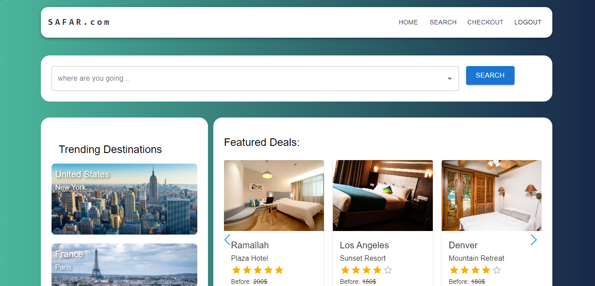
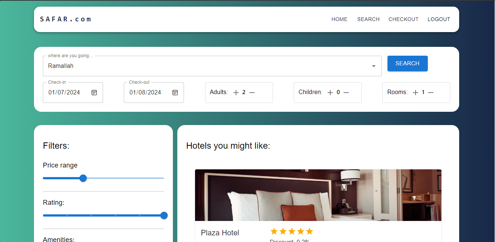
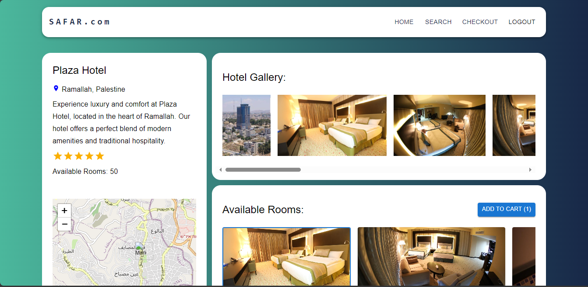
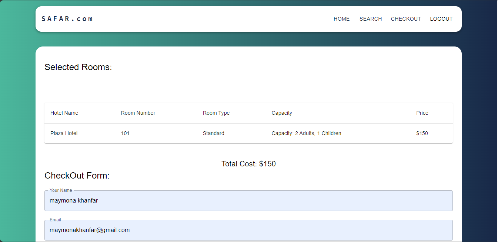
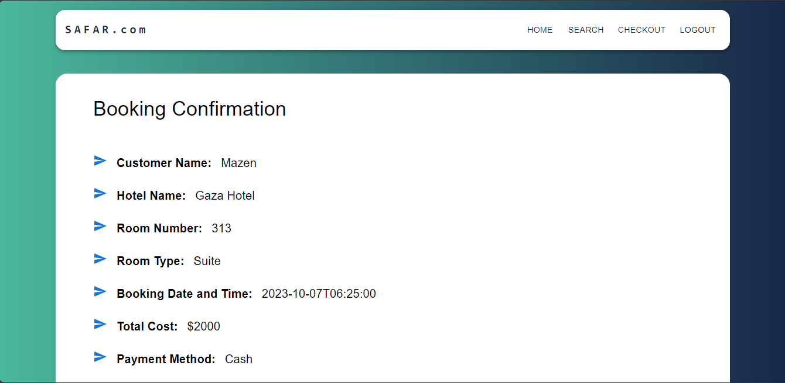
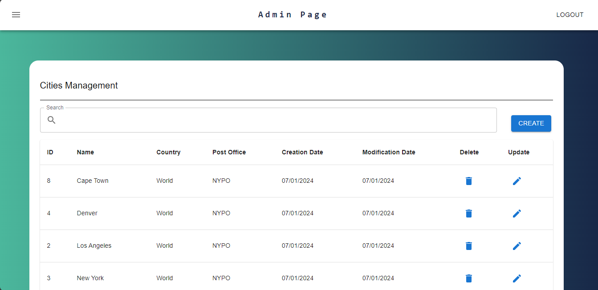

# Final-Project

    
    

<h1>Travel and Accommodation Booking Platform</h1>

<h2>Introduction:</h2>

Welcome to our <strong>Travel and Accommodation Booking Platform!</strong> This web application provides a seamless experience for users to search, explore, and book hotels with ease. Whether you're planning a business trip or a leisurely vacation, our platform is designed to cater to your travel needs.

<h2>Technologies used </h2>

 <li > </li>
    
<li>  </li>
<li><a href="https://formik.org/">Formik<a/></li>

<h2>Pages </h2>

<h4>Home Page : </h4>

Home page is designed to simplify your search process.Lets you easily find hotels, cities, and more. Featured Deals highlight special offers, and shows your recently visited hotels. Trending Destination Highlights provide inspiration for your next adventure.

 

 

<h4>Hotel Page : </h4>

Dive into the details of each hotel with our dedicated hotel pages. Galleries with high-quality images, and you can explore detailed information about the hotel, including its history and guest reviews. The room availability and selection feature makes booking a breeze.

 

<h4>Checkout and Confirmation Pages : </h4>

 Experience a secure and convenient checkout process. Provide your personal information and payment details in a user-friendly form. The confirmation page summarizes your booking details, allowing you to print or save the confirmation as a PDF for your records. 

 

 

<h4>Admin Page for Easy Management : </h4>

For administrators, our platform offers a streamlined management experience. Navigate through functional left-side navigation, use the admin search bar, and access detailed grids for cities, hotels, and rooms. The creation and update forms make managing your inventory effortless.

 

 

<h2>How to clone this project</h2>
<ul>   
<li> Above the list of files, click Code and copy the URL for the repository.</li>
 <li> Open Git Bash. </li>
 <li> Type git clone, and then paste the URL you copied earlier.</li>
 <li> Open it whit VSC and in backend directory</li>
 <li> Run --json-server --watch db.json --port 5000--</li>
 <li> Change directory to frontend by --cd frontend--</li>
 <li> Excute --npm start-- to start the projec</li>
</ul>

  

  
  <h2>Notes</h2>
 
 This project is a part of the <a href="https://www.foothillsolutions.com/">Foothill Solutions<a/>  internship program.

